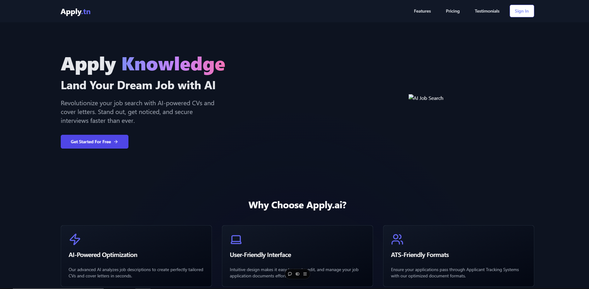

# AI-Powered Job Platform

## Project Overview

An innovative job platform leveraging AI technologies to revolutionize job matching and recruitment processes. Still a work-in-progress

## Current Deployment



**Continuous Deployment:** Automated via GitHub Actions to Vercel

## Tech Stack

- **Frontend:** Next.js
- **Backend:** FastAPI, AWS Lambda
- **Cloud:** AWS, Vercel
- **AI:** AWS Bedrock, Custom LLM Models
- **Database:** DynamoDB

## Key Features

- AI-powered job matching
- Serverless architecture
- Automated job scraping
- Robust cloud infrastructure

## Performance Metrics

- Millisecond-level latency
- 40% improved job data collection
- 30% fewer production issues

## Getting Started

### Prerequisites
- Node.js
- AWS Account
- FastAPI
- AWS CDK CLI

### Installation
```bash
git clone https://github.com/MayseenAidoudi/Apply-AI

```

## Deployment

Automatic deployment is configured through GitHub Actions to Vercel.

## Contributing
1. Fork the repository
2. Create feature branch
3. Commit changes
4. Push to branch
5. Create pull request


## Contact
Mayseen Aidoudi